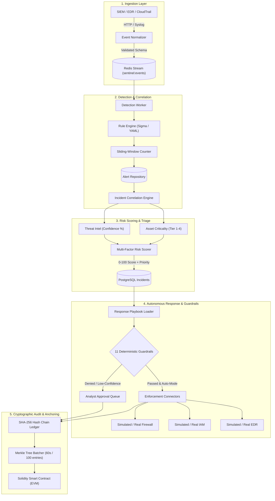
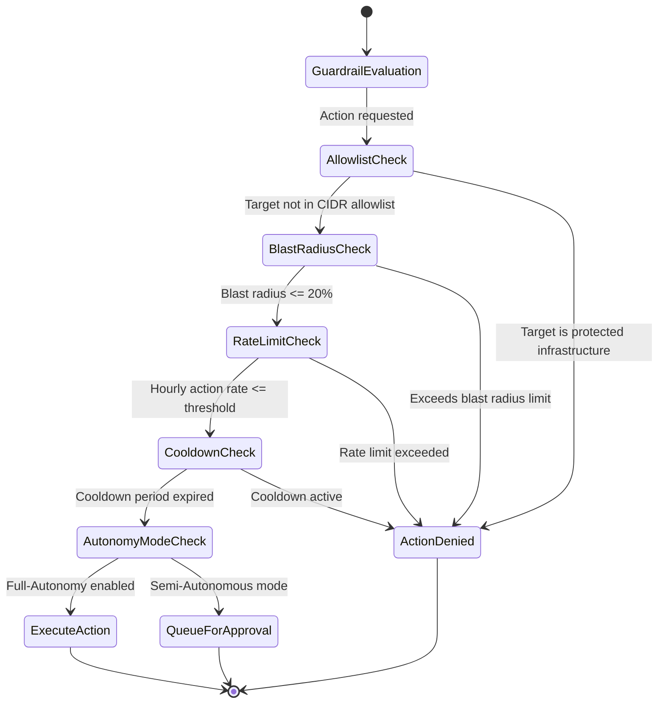
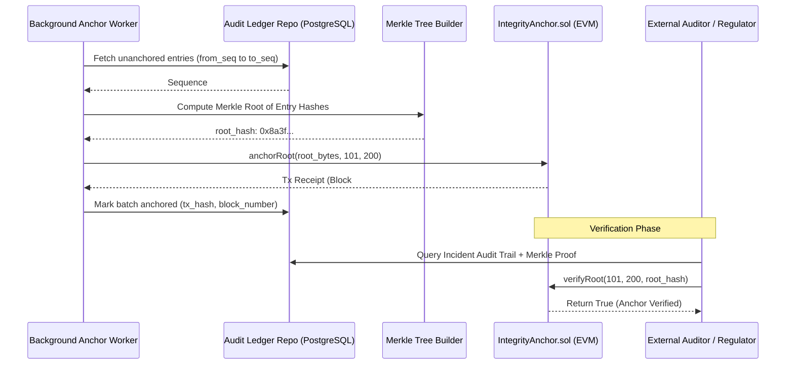

# SentinelChain Architecture & Technical Specification

**SentinelChain** is an enterprise-grade autonomous threat-response and incident-management platform. It ingests high-throughput security telemetry, identifies multi-stage attacks via sliding-window correlation, computes explainable multi-factor risk scores, executes safe automated containment under strict deterministic guardrails, and anchors tamper-evident cryptographic audit proofs to an EVM blockchain.

---

## 1. High-Level System Architecture

---

## 2. Event Ingestion & Normalization Pipeline

1. **Schema Enforcement**: Ingested JSON/Syslog payloads are validated and parsed into a strongly-typed `NormalizedEvent` domain entity.
2. **Buffering & Decoupling**: Events are pushed into a persistent **Redis Stream** (`sentinel:events`). Ingestion returns `202 Accepted` within $< 10\text{ms}$ with zero blocking dependencies on downstream databases.
3. **Consumer Groups**: Scalable asynchronous workers consume from the stream in parallel, maintaining high throughput during threat storms.

---

## 3. Explainable Multi-Factor Risk Scoring Engine

The risk score $R \in [0, 100]$ determines incident priority ($\text{P1 Critical}, \text{P2 High}, \text{P3 Medium}, \text{P4 Low}$) using five weighted dimensions:

$$R = w_s \cdot S + w_c \cdot C_a + w_i \cdot T_i + w_e \cdot E + w_b \cdot B_r$$

| Factor | Weight ($w$) | Description |
| :--- | :---: | :--- |
| **Event Severity ($S$)** | 30% | Base detection severity (Informational $\rightarrow$ Critical). |
| **Asset Criticality ($C_a$)** | 25% | Asset context rating (Tier 1 Crown Jewels $\rightarrow$ Tier 4 Sandbox). |
| **Threat Intel Confidence ($T_i$)** | 20% | Confidence score from threat intelligence indicators (IP/Domain/Hash). |
| **Exploitability ($E$)** | 15% | Known actively exploited vulnerabilities (CVE / CISA KEV catalog). |
| **Blast Radius Potential ($B_r$)** | 10% | Number of interconnected internal hosts or service dependencies. |

---

## 4. The 11 Deterministic Safety Guardrails

Every automated containment action must pass all applicable guardrails before execution:

1. **CIDR & Domain Allowlist**: Rejects containment against critical DNS, domain controllers, and corporate gateways.
2. **Blast Radius Limit**: Restricts actions from taking down more than a configured percentage of fleet infrastructure (default: 20%).
3. **Hourly Action Rate Limiting**: Prevents runaway automation cascades during distributed attacks.
4. **Target Cooldown Periods**: Enforces a time window between successive actions on the same asset.
5. **Autonomy Mode Enforcement**:
   - `MANUAL`: All actions require human authorization.
   - `SEMI_AUTONOMOUS`: Actions with risk score $\ge 80$ execute automatically; others queue for analyst review.
   - `FULL_AUTONOMOUS`: All valid guardrail-passing actions execute automatically.
6. **Action Idempotency Check**: Prevents duplicate executions on identical targets.
7. **Role-Based Execution Verification**: Validates caller permissions against RBAC matrix.
8. **Reversible Action Enforcement**: Requires automated actions to provide a deterministic rollback handler.
9. **TTL & Auto-Expiry**: Every containment action carries a time-to-live (TTL) to prevent permanent accidental lockouts.
10. **Canary Health Verification**: Continuously probes downstream system health post-execution.
11. **Cryptographic Ledger Attestation**: Every decision (execution, rejection, or denial) is recorded on the hash ledger.

---

## 5. Blockchain Integrity & Merkle Anchoring Architecture

> **Architectural Non-Negotiable**: Blockchain is used **strictly for integrity proofs and non-repudiation**. Detection and response execution are 100% off-chain and ultra-fast.

---

## 6. Threat Modeling & Failure Mode Defenses

| Threat / Failure Scenario | Architectural Defense |
| :--- | :--- |
| **Adversary Tampering with PostgreSQL Logs** | The hash chain $H_n = \text{SHA256}(H_{n-1} \parallel \text{Payload}_n)$ breaks immediately upon any row modification, detected instantly by `IntegrityVerificationService`. |
| **Adversary Deleting Historical Log Rows** | On-chain Merkle root permanently binds the sequence range (`from_seq` to `to_seq`). Missing rows cause Merkle proof reconstruction to fail. |
| **Denial of Service (DoS) via High-Volume Log Flooding** | Redis Stream buffer prevents database exhaustion; Sliding-Window counters throttle duplicate alert generation. |
| **Runaway Autonomous Containment (Self-DoS)** | Action rate-limit guardrails and blast-radius caps immediately suppress containment cascades. |
| **RPC Node Failure / Chain Reorgs** | Anchor worker retries with exponential backoff; containment and response operate seamlessly without blockchain dependency. |
