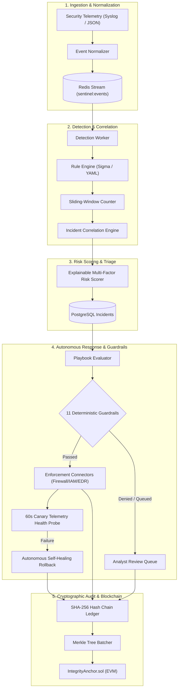

# SentinelChain (Slytherin-Chain)

> **Autonomous Threat Response & Incident Management Platform with Blockchain-Anchored Audit Integrity**

[](https://github.com/codergangganesh/Slytherin-Chain/actions)
[](https://www.python.org/)
[](https://fastapi.tiangolo.com/)
[](https://react.dev/)
[](https://soliditylang.org/)
[](https://mypy.readthedocs.io/)
[](https://github.com/astral-sh/ruff)
[](LICENSE)

---

## Executive Summary

**SentinelChain** is an enterprise-grade autonomous threat-response and incident-management platform. It ingests real-time security events across diverse infrastructure, detects multi-stage threats using sliding-window correlation, computes explainable multi-factor risk scores, executes automated containment actions (IP block, host quarantine, account restriction) under **11 deterministic safety guardrails**, and anchors cryptographic Merkle-tree proofs to an EVM blockchain for tamper-evident audit non-repudiation.

```
                                      SENTINELCHAIN AT A GLANCE
  ┌──────────────────────┐      ┌─────────────────────────┐      ┌─────────────────────────┐
  │  Ingest & Correlate  │ ───► │  Explainable Scoring    │ ───► │  Autonomous Containment │
  │  Multi-Source Logs   │      │  5-Factor Risk Weight   │      │  11 Safety Guardrails   │
  └──────────────────────┘      └─────────────────────────┘      └────────────┬────────────┘
                                                                              │
                                                                 ┌────────────▼────────────┐
                                                                 │  Blockchain Anchoring   │
                                                                 │  EVM Merkle Integrity  │
                                                                 └─────────────────────────┘
```

---

## Key Differentiators & Competitive Comparison

| Feature | Legacy SIEM (Splunk, Elastic) | Traditional SOAR (Cortex, Splunk SOAR) | **SentinelChain** |
| :--- | :---: | :---: | :---: |
| **Response Speed** | Manual (Hours to Days) | Scripted / Semi-Auto (Minutes) | **Autonomous (< 4 Seconds)** |
| **Safety Guardrails** | None | Basic Conditionals | **11 Deterministic Guardrails + Canary Check** |
| **Decision Transparency** | Black-box Alert Score | Static Playbook Branching | **Explainable "Why / Why-Not" Decision Graph** |
| **Self-Healing Rollback** | Manual Remediation | Manual Playbook Rollback | **Autonomous Telemetry Canary Auto-Rollback** |
| **Audit Non-Repudiation** | Mutable PostgreSQL / Log Files | Mutable Database Logs | **SHA-256 Hash Chain + EVM Smart Contract** |
| **Regulatory Sharing** | Raw Logs (PII Leak Risk) | Manual Redaction | **Dual-Layer Redacted Cryptographic Export** |

---

## System Architecture



---

## The 11 Deterministic Safety Guardrails

Every automated response action must strictly pass all 11 guardrail checks before execution:

1. **CIDR / Domain Allowlist**: Never blocks DNS, corporate gateways, identity providers, or domain controllers.
2. **Blast Radius Cap**: Prohibits containment from affecting more than a configured percentage of infrastructure (default: 20%).
3. **Action Rate Limiting**: Throttles autonomous containment frequency to prevent runaway cascades.
4. **Target Cooldown**: Enforces recovery windows between sequential actions on identical entities.
5. **Autonomy Mode Switch**: Supports `MANUAL`, `SEMI_AUTONOMOUS` (P1/P2 auto), and `FULL_AUTONOMOUS`.
6. **Action Idempotency**: Prevents double-execution of identical containment directives.
7. **Role-Based Authorization**: Enforces strict RBAC (Viewer, Analyst, Operator, Admin) for write operations.
8. **Reversibility Guarantee**: Requires every executed action to have a tested rollback pathway.
9. **TTL & Auto-Expiry**: All temporary network/account blocks automatically expire unless renewed.
10. **Canary Telemetry Health Probe**: Continuously verifies post-execution heartbeat before confirming permanent status.
11. **Cryptographic Ledger Non-Repudiation**: Logs every decision (executed, denied, or queued) to the immutable hash chain.

---

## Quick Start (Docker Compose)

### 1. Clone & Configure
```bash
git clone https://github.com/codergangganesh/Slytherin-Chain.git
cd Slytherin-Chain
cp .env.example .env
```

### 2. Launch Full Stack
```bash
# Starts PostgreSQL 16, Redis 7, MinIO S3, Anvil EVM, FastAPI Backend, and Vite React Frontend
docker compose up --build -d
```

### 3. Access Services & Demo Logins
* **Web Dashboard**: [http://localhost:5173](http://localhost:5173)
* **REST API & Swagger**: [http://localhost:8000/docs](http://localhost:8000/docs)
* **MinIO Object Storage**: [http://localhost:9001](http://localhost:9001)

| Role | Username | Demo Password |
| :--- | :--- | :--- |
| **Admin** | `admin` | `admin_demo_password` |
| **Analyst** | `analyst` | `analyst_demo_password` |
| **Viewer** | `viewer` | `viewer_demo_password` |

---

## Live Demo Walkthrough (3-Minute Evaluation Script)

1. **Launch Attack Simulation**: Open the dashboard at `http://localhost:5173`, click **"Simulate Attack"** in the top navigation, and select `Ransomware Lateral Movement`.
2. **Observe Real-Time Triage**: Watch the event stream into Redis, trigger sliding-window correlation, and create a **P1 Critical Incident** with risk score 92/100.
3. **Inspect Explainable Guardrails**: Click the incident to view the **Guardrail Reasoning Card** displaying why `ISOLATE_HOST` passed all 11 checks.
4. **Verify Autonomous Containment**: View the containment action execute and transition to `CANARY_VERIFIED`.
5. **Blockchain Audit Attestation**: Open the **Integrity** tab to view the SHA-256 Merkle batch anchored on the EVM smart contract (`IntegrityAnchor.sol`).
6. **Generate Redacted PDF Report**: Download a sanitized compliance report ready for regulatory or insurer submission.

---

## Repository Documentation

* [ARCHITECTURE.md](ARCHITECTURE.md) — Comprehensive technical architecture, scoring formulas, and data pipeline specs.
* [SECURITY.md](SECURITY.md) — Security policies, default-safe execution philosophy, and RBAC matrix.
* [CONTRIBUTING.md](CONTRIBUTING.md) — Local development guidelines, linting instructions, and PR requirements.

---

## License

This project is licensed under the MIT License — see the [LICENSE](LICENSE) file for details.
