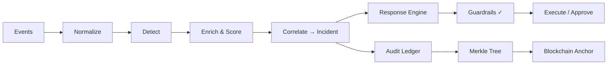

# SentinelChain

> **Autonomous Response & Incident Management Platform** — Detects threats, responds autonomously under strict safety guardrails, tracks incidents end-to-end, generates structured reports, and anchors tamper-evident integrity proofs on a blockchain.

[](.github/workflows/ci.yml)
[](LICENSE)

---

## The Problem

Manual incident response is too slow. When a security event fires at 2 AM, the mean time to contain can stretch to hours — or days. Meanwhile, audit trails stored in mutable databases can be silently altered, destroying the chain of evidence that investigators and compliance officers depend on.

**SentinelChain** solves both problems: it responds to threats in seconds under strict safety guardrails, and it anchors a tamper-evident proof of every decision on a blockchain so that no one — not even a database administrator — can rewrite history undetected.

## What It Does

1. **Autonomous Threat Response** — Automatically blocks IPs, isolates hosts, and restricts accounts when threats are detected, with 11 guardrails ensuring safe operation.
2. **Intelligent Incident Management** — Correlates alerts into incidents, scores risk with an explainable formula, and manages the full lifecycle from detection to resolution.
3. **Structured Reporting** — Generates comprehensive incident reports (PDF, Markdown, JSON) with attack timelines, MITRE ATT&CK mappings, and evidence chains.
4. **Blockchain Integrity Anchoring** — Every action, decision, and piece of evidence is recorded in a hash chain, batched into Merkle trees, and anchored on-chain — making any tampering mathematically detectable.

## Screenshots

> *Screenshots will be added after the frontend is complete (Phase 8).*

## Architecture



**Storage:** PostgreSQL (data + ledger) · Redis (streams, cache) · MinIO (evidence, reports)
**Frontend:** React dashboard ⇄ FastAPI REST + WebSocket

## How and Why Blockchain Is Used

**What is anchored:** SHA-256 Merkle roots of audit-trail batches — containing hashes of every incident action, state change, and evidence addition.

**What is NOT on-chain:** Raw events, incident data, PII, evidence files, or any large payload. Only a 32-byte hash per batch.

**Why this design:** Storing data on-chain is expensive, slow, and creates GDPR issues. Our approach gives tamper-evidence at minimal cost — if anyone modifies a past ledger entry (even with direct DB access), the hash chain breaks, the Merkle root won't match, and the on-chain anchor proves the original state.

## Safety Design

| Guardrail | What it prevents |
|-----------|-----------------|
| Autonomy mode switch | Admin controls: off / recommend / approval / auto |
| IP allowlist | Never blocks gateways, DNS, admin IPs |
| Protected assets | Critical assets always need human approval |
| Confidence threshold | Low-confidence detections don't trigger actions |
| High-impact approval | Host isolation and account disabling need review |
| Blast-radius limit | Rate limits prevent cascading automation |
| Idempotency | Same action isn't executed twice |
| TTL auto-expiry | All blocks expire unless extended |
| Dry-run mode | Preview what would happen |
| Manual rollback | Any action can be reversed with a reason |
| Full audit trail | Every decision recorded, including denials |

## Tech Stack

| Layer | Technology |
|-------|-----------|
| Backend | Python 3.12, FastAPI, SQLAlchemy 2.0, Pydantic v2 |
| Database | PostgreSQL 16 (JSONB + GIN indexes) |
| Queue | Redis Streams with consumer groups |
| Object Storage | MinIO (S3-compatible) |
| Auth | JWT + Argon2, RBAC (viewer/analyst/admin) |
| Smart Contract | Solidity 0.8.28, Foundry |
| Chain Client | web3.py |
| Chain (dev) | Local Anvil |
| Chain (demo) | Ethereum Sepolia testnet |
| Frontend | React 19, TypeScript, Vite, Tailwind CSS |
| Testing | pytest, Foundry, Vitest |
| CI/CD | GitHub Actions |
| Packaging | Docker + Docker Compose |

## Quick Start

### Prerequisites

- Docker Desktop (with Docker Compose v2)
- Git

### Setup

```bash
# Clone the repository
git clone <repo-url>
cd sentinelchain

# Copy environment config
cp .env.example .env

# Start all services (PostgreSQL, Redis, MinIO, Anvil, Backend, Workers, Frontend)
docker compose up --build

# In another terminal, seed demo data
docker compose exec backend python -m scripts.seed_demo_data
```

### URLs and Demo Logins

| Service | URL |
|---------|-----|
| Dashboard | http://localhost:5173 |
| API Docs | http://localhost:8000/docs |
| MinIO Console | http://localhost:9001 |

| User | Password | Role |
|------|----------|------|
| admin | admin_demo_password | Admin |
| analyst | analyst_demo_password | Analyst |
| viewer | viewer_demo_password | Viewer |

> ⚠️ These are demo-only credentials. Never use in production.

## Run the Demo

1. Open the Dashboard at http://localhost:5173
2. Navigate to the **Simulator** page
3. Run the `ssh_brute_force_compromise` scenario
4. Watch the P1 incident appear in real-time
5. Click into the incident to see the attack timeline, risk breakdown, and auto IP block
6. Run `benign_admin_scan_false_positive` — see the guardrail denial
7. Run `ransomware_activity` — approve the host isolation
8. Generate a PDF report with integrity attestation
9. Open the **Integrity** page — see anchored batches
10. Run `python scripts/simulate_tampering.py` — click "Verify now" — see `TAMPERED`

## Configuration Reference

See [.env.example](.env.example) for all environment variables with defaults and descriptions.

## Project Structure

```
sentinelchain/
├── backend/          # FastAPI backend + workers
│   ├── app/
│   │   ├── api/      # HTTP routes + schemas
│   │   ├── config/   # Settings + logging
│   │   ├── domain/   # Pure business objects
│   │   ├── services/ # Use-case logic
│   │   ├── adapters/ # External integrations
│   │   ├── repositories/ # Database access
│   │   ├── db/       # ORM models + session
│   │   └── workers/  # Background consumers
│   ├── rules/        # YAML detection rules
│   ├── playbooks/    # YAML response playbooks
│   └── tests/
├── contracts/        # Solidity + Foundry
├── frontend/         # React + TypeScript + Vite
├── simulator/        # Attack scenario scripts
├── scripts/          # Seed, verify, tamper scripts
└── docs/             # Documentation
```

## API Overview

Full OpenAPI documentation available at http://localhost:8000/docs

See [docs/api-reference.md](docs/api-reference.md) for endpoint summary.

## Testing

```bash
# Backend tests
cd backend && python -m pytest tests/ -v --cov=app

# Contract tests
cd contracts && forge test -vvv

# Frontend tests
cd frontend && npm run test

# Linting
cd backend && ruff check . && mypy --strict app/
cd frontend && npx eslint src/ && npx tsc --noEmit
```

## Security Notes and Limitations

See [docs/security-considerations.md](docs/security-considerations.md).

## Roadmap

See [docs/future-work.md](docs/future-work.md).

## Contributing

1. Fork the repository
2. Create a feature branch
3. Follow the code quality rules in `AGENTS.md`
4. Submit a pull request

## License

MIT — see [LICENSE](LICENSE).
