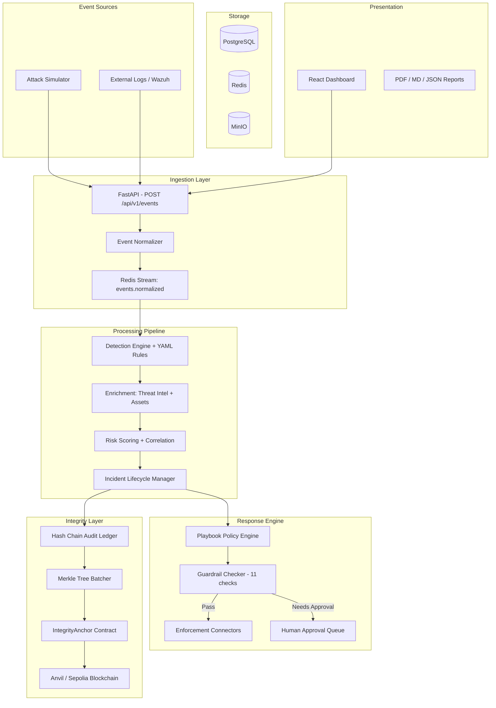

# Architecture

> **What this covers:** System architecture, component responsibilities, and data flow.
> **Who should read it:** Developers, reviewers, and anyone evaluating the platform design.

## System Architecture

## Component Responsibilities

*Detailed component descriptions will be added as each phase is implemented.*

## Data Flow

1. **Events** arrive via HTTP → normalized → published to Redis Stream
2. **Detection worker** consumes events → evaluates rules → creates alerts
3. **Enrichment** adds threat intel + asset context → risk scoring
4. **Correlation** groups alerts into incidents → state machine manages lifecycle
5. **Response engine** matches playbooks → guardrails check → execute or queue approval
6. **Audit ledger** records every decision → Merkle batching → on-chain anchoring
7. **Dashboard** displays real-time state → reports generated on demand
