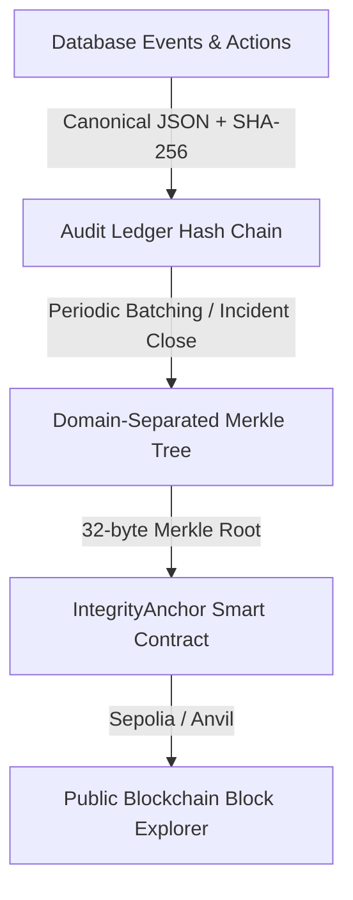

# Blockchain Integrity Layer

> **What this covers:** How audit-trail integrity is guaranteed using hash chains, Merkle trees, and blockchain anchoring.  
> **Who should read it:** Developers, security auditors, and hackathon judges evaluating the blockchain architecture.

---

## 1. Why Blockchain is Used (and Why ONLY for Anchoring)

A common flaw in security platforms is that an attacker who compromises the database or an administrator with root access can alter past incident logs, delete evidence records, or change timestamps to cover their tracks.

**SentinelChain solves this without putting raw security data on-chain:**
1. **Zero Data Privacy & GDPR Issues:** Raw IP addresses, employee usernames, logs, and payload data are never written to the blockchain.
2. **Deterministic High Throughput:** Detection and automated containment execute in milliseconds without waiting for blockchain block confirmations.
3. **Zero Gas Waste:** Thousands of ledger records are batched into a single 32-byte Merkle root.
4. **Permanent Tamper-Evidence:** If any row in the database is modified or deleted, the hash chain breaks immediately, and recomputing the Merkle root produces a mismatch against the immutable root anchored on the smart contract.

---

## 2. The 3-Tier Integrity Model

### Tier 1: SHA-256 Hash Chain Ledger (PostgreSQL)
Every incident creation, alert attachment, risk score change, state transition, action execution/denial/rollback, and report generation appends an immutable entry to `audit_ledger_entries`.

- **Hash Formula:**
  $$\text{entry\_hash} = \text{SHA256}(\text{canonical\_json}(\text{entry\_type}, \text{incident\_id}, \text{payload}, \text{created\_at}, \text{sequence\_number}) \mathbin{\Vert} \text{previous\_hash})$$
- **Genesis Block:** Sequence `#1` previous hash is 64 zeros (`0000000000000000000000000000000000000000000000000000000000000000`).
- **Canonical JSON:** Strict alphabetical key sorting, compact delimiters (`,`, `:`), standardized ISO-8601 UTC timestamps, deterministic UTF-8 bytes.

### Tier 2: Domain-Separated Merkle Tree
Unanchored ledger records are aggregated into Merkle trees:
- **Leaf Prefix:** `0x00` ($\text{leaf\_hash} = \text{SHA256}(0\text{x}00 \mathbin{\Vert} \text{entry\_hash})$)
- **Internal Node Prefix:** `0x01` ($\text{parent\_hash} = \text{SHA256}(0\text{x}01 \mathbin{\Vert} \text{left\_child} \mathbin{\Vert} \text{right\_child})$)
- **Odd Leaf Handling:** Promoted directly to the parent tier without duplicating nodes.

### Tier 3: On-Chain Smart Contract (`IntegrityAnchor.sol`)
Authorized anchor workers submit `anchorRoot(bytes32 merkleRoot, uint64 fromSequence, uint64 toSequence)` to the Solidity contract. The contract guarantees non-overlapping, strictly increasing sequence ranges and emits `RootAnchored` events.

---

## 3. Verification Protocol

1. **Chain Check:** Re-walks all ledger records from sequence `#1` to head, recomputing every hash. Any modified payload immediately identifies the exact tampered sequence number.
2. **Batch Check:** Rebuilds the Merkle tree for each sequence interval and compares the computed root with the batch root.
3. **On-Chain Check:** Reads the anchored root from the smart contract on the blockchain.

### Status Verdicts
- `VERIFIED`: All ledger entries, batch roots, and on-chain records match cryptographically.
- `TAMPERED`: Identifies exact sequence number and batch ID where tampering occurred.
- `PENDING_ANCHOR`: All entries valid; recent entries await the next periodic batch.
- `CHAIN_UNAVAILABLE`: Local ledger is valid, but RPC node is currently unreachable.
